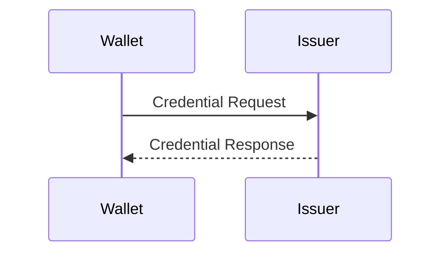

# Reading Guide

This documentation spans 13 sections (00 through 12) plus an appendix. This guide explains how to navigate it depending on your goals.

---

## Sequential Reading Order

For a comprehensive understanding of SSI credential issuance, read the sections in order. Each section builds on concepts introduced in the previous one.

| Order | Section | What You Will Learn |
|-------|---------|---------------------|
| 1 | **00 — Introduction** (this section) | The conceptual model: trust triangle, Verifiable Credentials, the three implementations. |
| 2 | **01 — Architecture Overview** | How each wallet structures its issuance pipeline. SDK layering, module boundaries, data flow. |
| 3 | **02 — Credential Offer** | How issuance begins: QR codes, deep links, offer parsing, transport mechanisms. |
| 4 | **03 — Issuer Metadata Discovery** | How the wallet learns what the issuer supports: well-known endpoints, credential configurations, display metadata. |
| 5 | **04 — Authorization & Token** | How the wallet authenticates: OAuth 2.0, PAR, DPoP, pre-authorized code, PKCE, token exchange. |
| 6 | **05 — Nonce & Replay Protection** | How replay attacks are prevented: `c_nonce` lifecycle, transaction codes, nonce rotation. |
| 7 | **06 — Key Attestation** | How the wallet proves its keys are legitimate: hardware attestation, wallet attestation, key provenance. |
| 8 | **07 — Proof Construction** | How the wallet constructs proof-of-possession: JWT signing, key binding, nonce inclusion. |
| 9 | **08 — Credential Request** | How the wallet requests the credential: POST /credential, payload structure, Draft 13 vs. Final differences. |
| 10 | **09 — Issuer Response** | How the issuer delivers the credential: immediate vs. deferred issuance, notification endpoints, error handling. |
| 11 | **10 — Secure Storage** | How the wallet stores the credential: encrypted databases, hardware-backed key storage, data models. |
| 12 | **11 — Cryptography Deep Dive** | Every cryptographic algorithm, protocol, and mechanism referenced in the preceding sections, explained in depth. |
| 13 | **12 — Comparative Summary** | Executive comparison across all three implementations: decision framework, feature matrices, trade-off analysis. |
| Ref | **Appendix** | Glossary, full standards references, and supplementary material. |

This sequential path takes you from "what is a Verifiable Credential" to "here is exactly how each implementation stores it in hardware-backed encrypted storage," with every intermediate step explained.

---

## Quick-Reference Paths

If you have a specific goal, use these targeted reading paths instead of reading everything sequentially.

### "I need to choose between architectural approaches."

1. [01 — Architecture Overview](../01-architecture/) — Understand how each implementation is structured.
2. [12 — Comparative Summary](../12-comparative-summary/) — Side-by-side decision framework.
3. [Implementations Overview](./implementations-overview.md) — Quick profile of each system.

### "I need to understand a specific issuance step."

Jump directly to the relevant section (02 through 10). Each section is self-contained with:
- A conceptual overview of the step
- How each implementation handles it
- A comparison table for that step
- References to related sections where relevant

For example, if you need to understand how authorization works, go to [04 — Authorization & Token](../04-authorization-and-token/). You do not need to read sections 02 and 03 first, though they provide useful context.

### "I need to understand the cryptographic details."

1. [11 — Cryptography Deep Dive](../11-cryptography/) — The primary reference for all cryptographic mechanisms.
2. [06 — Key Attestation](../06-key-attestation/) — Hardware key attestation and wallet attestation.
3. [07 — Proof Construction](../07-proof-construction/) — Signature construction and proof-of-possession.
4. [10 — Secure Storage](../10-secure-storage/) — Key storage security models.

### "I need to integrate with a specific implementation."

**For EUDI (Android):** Follow the sequential path but focus on the Kotlin/Android details in each section. Key sections: 01 (architecture), 04 (PAR/DPoP), 06 (Android Keystore attestation), 10 (Android secure storage).

**For EUDI (iOS):** Same as above, focusing on Swift/iOS details. Key sections: 01 (architecture), 04 (PAR/DPoP), 06 (Secure Enclave attestation), 10 (iOS secure storage).

**For Procivis ONE:** Focus on the multi-protocol and multi-format aspects. Key sections: 01 (architecture), 02 (multiple transports), 04 (multiple OID4VCI versions), 07 (multiple proof types including BBS+), 11 (post-quantum cryptography).

**For Affinidi:** Focus on the cloud-service integration aspects. Key sections: 01 (architecture), 02 (credential offer construction), 04 (pre-authorized code flow with TX_CODE), 09 (issuer response handling).

---

## Conventions Used

### Code References

Code references throughout this documentation cite actual source files from the analyzed repositories. References follow this format:

```
Source: EudiWallet.kt — openId4VciManager.issueDocumentByOfferUri()
```

This means the relevant code is in the file `EudiWallet.kt`, in the method `issueDocumentByOfferUri()` on the `openId4VciManager` object. File paths and method names reference the specific SDK versions listed in [Implementations Overview](./implementations-overview.md).

When a reference points to a configuration or manifest rather than executable code, it is noted:

```
Source: AndroidManifest.xml — <uses-permission android:name="...">
```

### Diagrams

Sequence diagrams and flow diagrams use Mermaid syntax and are embedded directly in the markdown as fenced code blocks:

````

````

Render these with any Mermaid-compatible viewer (GitHub, GitLab, VS Code with a Mermaid extension, or mermaid.live).

### Comparison Tables

Every section where implementations diverge includes a comparison table with the following structure:

| Aspect | EUDI (Android) | EUDI (iOS) | Procivis ONE | Affinidi |
|--------|----------------|------------|--------------|----------|
| *(dimension)* | *(detail)* | *(detail)* | *(detail)* | *(detail)* |

When an implementation does not support a feature or abstracts it away, the table cell states this explicitly (e.g., "Not supported," "Abstracted by cloud service," or "Not applicable") rather than leaving it blank.

### Terminology

Technical terms are used consistently throughout the documentation. The first occurrence of a non-obvious term in each section includes a brief inline definition. The [Appendix — Glossary](../appendix/) provides a comprehensive reference.

Key terms used frequently:

- **OID4VCI**: OpenID for Verifiable Credential Issuance
- **c_nonce**: A server-provided cryptographic nonce used in proof-of-possession
- **PAR**: Pushed Authorization Requests (RFC 9126)
- **DPoP**: Demonstration of Proof-of-Possession (RFC 9449)
- **mDoc**: Mobile document format per ISO 18013-5
- **SD-JWT**: Selective Disclosure JSON Web Token
- **PID**: Person Identification Data (EU-specific credential type)

---

## A Note on the Affinidi Analysis

The EUDI and Procivis ONE analyses in this documentation are based on direct source code inspection. Specific files, classes, methods, and control flow paths are referenced and explained.

The Affinidi analysis is based on **public documentation only** — API references, developer guides, published architecture descriptions, and sample code. Affinidi's issuance service is a managed cloud platform; its internal source code is not available in the workspace and was not inspected.

This means:

- **What is covered**: The external behavior of Affinidi's issuance flow, the API contracts, the supported credential formats, the documented configuration options, and the integration patterns.

- **What is not covered**: Internal implementation details such as how Affinidi constructs credentials server-side, how it manages signing keys internally, or what specific database or HSM infrastructure backs the service.

- **How this affects comparisons**: When a comparison table includes an Affinidi column, the information reflects what Affinidi publicly documents. Where internal behavior is unknown or ambiguous, this is stated explicitly (e.g., "Implementation details not publicly documented").

This distinction is noted wherever it is relevant throughout the documentation. It does not diminish the value of the Affinidi analysis — the external behavior and integration model are well-documented and provide clear architectural contrast with the other two implementations.

---

**Next**: [01 — Architecture Overview](../01-architecture/) — Begin the technical deep dive.
