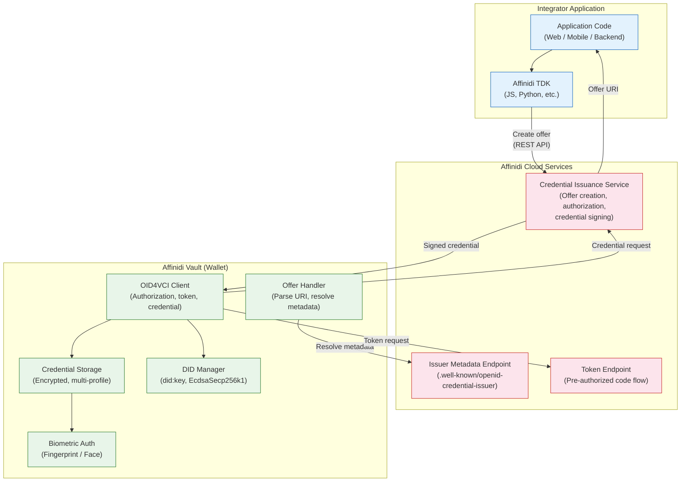

# Affinidi Architecture for Issuance

Affinidi provides a cloud-based credential issuance architecture where the protocol engine runs as a managed service rather than inside the wallet application. The wallet component (Affinidi Vault) handles secure storage and user interaction, while the Credential Issuance Service handles offer creation, authorization, and credential generation. This document describes the service architecture, the Vault, the TDK client libraries, and the configuration-driven issuance model.

> **Note:** This analysis is based on Affinidi's public documentation, API references, and TDK source code. The Affinidi Vault and Credential Issuance Service are closed-source managed services; internal implementation details are inferred from their documented behavior and API contracts.

---

## 1. Service Architecture Overview

Affinidi's issuance architecture separates concerns across three primary components:

| Component | Role | Deployment |
|-----------|------|------------|
| **Credential Issuance Service** | Creates credential offers, manages authorization, generates and signs credentials | Cloud-hosted managed service |
| **Affinidi Vault** | User-facing wallet; stores credentials, manages DIDs, handles biometric authentication | Mobile / web application (managed by Affinidi) |
| **Affinidi TDK** | Client libraries for integrators; wraps service APIs in language-native interfaces | Developer-side (npm, pip, etc.) |

Unlike EUDI and Procivis, where the wallet application contains the protocol engine, Affinidi's wallet (Vault) is a thin client that receives credential offers and executes the OID4VCI exchange against the cloud service. The protocol logic — metadata hosting, authorization, nonce management, credential signing — lives server-side.

---

## 2. Affinidi Vault

The Affinidi Vault is the wallet component in the Affinidi ecosystem. It provides:

### Secure Storage

Credentials are stored in the Vault with encryption at rest. The storage layer supports multiple credential formats, including W3C Verifiable Credentials in JSON-LD.

### Multi-Profile Support

A single Vault instance can manage multiple identity profiles, each with its own set of credentials, DIDs, and associated metadata. This allows users to maintain separate professional, personal, and governmental identity contexts within one application.

### Biometric Authentication

Access to the Vault and its stored credentials is gated by biometric authentication (fingerprint, face recognition) on supported devices. This replaces the PIN-based or combined PIN+biometric approaches seen in EUDI and Procivis.

### DID Management

The Vault manages the holder's DID lifecycle, including:
- Key generation using the `did:key` method
- DID document creation and resolution
- Signing with `EcdsaSecp256k1Signature2019`

---

## 3. Credential Issuance Service

The Credential Issuance Service is the server-side component that drives the issuance flow. It is configured declaratively and exposes OID4VCI-compliant endpoints.

### Configuration Model

Issuance behavior is defined through configuration rather than code. An integrator configures:

1. **Signing wallet** — Which DID and key material the service uses to sign issued credentials.
2. **Supported schemas** — Which credential types the service can issue, defined by JSON-LD context and type declarations.
3. **Claim modes** — How holders claim their credentials (see below).
4. **Credential metadata** — Display names, descriptions, and visual rendering hints.

```json
{
  "issuerWalletId": "wallet-abc-123",
  "credentialSchemas": [
    {
      "type": "VerifiableCredential",
      "jsonLdContext": "https://schema.example.com/v1",
      "credentialSubjectFields": [
        { "name": "givenName", "type": "string" },
        { "name": "familyName", "type": "string" },
        { "name": "dateOfBirth", "type": "date" }
      ]
    }
  ],
  "claimMode": "TX_CODE"
}
```

### Claim Modes

The service supports two claim modes that determine how a holder claims a credential offer:

| Mode | Mechanism | Use Case |
|------|-----------|----------|
| `TX_CODE` | The service generates a one-time transaction code delivered out-of-band (email, SMS). The holder presents this code during the OID4VCI exchange to prove they are the intended recipient. | Issuance to users who may not have a pre-established DID relationship with the issuer. |
| `FIXED_HOLDER` | The offer is bound to a specific holder DID. Only a Vault instance controlling that DID can claim the credential. No additional out-of-band verification is needed. | Issuance to known holders with established DID-based relationships. |

### Offer Creation and Claiming Flow

1. **Integrator creates an offer** — via TDK or direct API call, specifying credential type, subject data, and claim mode.
2. **Service generates offer URI** — an `openid-credential-offer://` URI containing the offer reference.
3. **Offer is delivered to holder** — via QR code, deep link, email, or other channel.
4. **Holder opens offer in Vault** — the Vault parses the URI, resolves issuer metadata, and displays the offer.
5. **Holder claims the credential** — the Vault executes the OID4VCI exchange (authorization, token, credential request) against the Credential Issuance Service.
6. **Service issues credential** — signs the credential with the configured wallet and returns it.
7. **Vault stores credential** — persists the issued credential locally.

---

## 4. Affinidi TDK

The Affinidi Trust Development Kit (TDK) provides client libraries that wrap the Credential Issuance Service API. The TDK is available in multiple languages:

- **JavaScript / TypeScript** — `@affinidi-tdk/credential-issuance-client`
- **Python** — `affinidi_tdk_credential_issuance_client`
- **Additional languages** — available via OpenAPI-generated clients

### TDK Usage for Issuance

```typescript
import { IssuanceApi, Configuration } from "@affinidi-tdk/credential-issuance-client";

const config = new Configuration({
  apiKey: process.env.AFFINIDI_API_KEY,
});

const issuanceApi = new IssuanceApi(config);

// Create a credential offer
const offer = await issuanceApi.createCredentialOffer({
  credentialTypeId: "IdentityCredential",
  claimMode: "TX_CODE",
  credentialSubject: {
    givenName: "Jane",
    familyName: "Doe",
    dateOfBirth: "1990-01-15",
  },
});

// offer.credentialOfferUri contains the OID4VCI offer URI
// Deliver this to the holder (QR code, deep link, etc.)
```

The TDK handles:
- Authentication with the Affinidi platform
- Request serialization and response deserialization
- Error mapping to language-native exceptions
- Pagination for list endpoints

The TDK does **not** handle the OID4VCI protocol exchange itself — that happens between the Vault and the Credential Issuance Service directly.

---

## 5. Cryptographic Choices

| Aspect | Choice |
|--------|--------|
| DID method | `did:key` |
| Signature algorithm | `EcdsaSecp256k1Signature2019` |
| Credential format | W3C Verifiable Credentials Data Model (JSON-LD) |
| Key management | Server-side for issuer keys; Vault-side for holder keys |

### did:key

Affinidi uses `did:key` for both issuer and holder identities. This method encodes the public key directly in the DID string, eliminating the need for a DID resolution network. The trade-off is that `did:key` DIDs cannot be updated or rotated — a new key means a new DID.

### W3C VC Data Model with JSON-LD

Credentials follow the W3C Verifiable Credentials Data Model 1.1, using JSON-LD for semantic context. Each credential includes:

- `@context` — JSON-LD context URIs defining the vocabulary
- `type` — credential type declarations
- `issuer` — issuer DID
- `credentialSubject` — claims about the holder
- `proof` — `EcdsaSecp256k1Signature2019` proof object

```json
{
  "@context": [
    "https://www.w3.org/2018/credentials/v1",
    "https://schema.affinidi.com/v1"
  ],
  "type": ["VerifiableCredential", "IdentityCredential"],
  "issuer": "did:key:zQ3sh...",
  "issuanceDate": "2025-01-15T00:00:00Z",
  "credentialSubject": {
    "id": "did:key:zQ3ab...",
    "givenName": "Jane",
    "familyName": "Doe"
  },
  "proof": {
    "type": "EcdsaSecp256k1Signature2019",
    "created": "2025-01-15T00:00:00Z",
    "proofPurpose": "assertionMethod",
    "verificationMethod": "did:key:zQ3sh...#zQ3sh...",
    "jws": "eyJhbGciOi..."
  }
}
```

---

## 6. Layer Diagram



---

## 7. Key Architectural Distinctions

### Cloud-First Protocol Engine

The most significant architectural difference from EUDI and Procivis is that the OID4VCI protocol engine runs server-side. The Vault acts as an OID4VCI client, but the issuer metadata, authorization server, and credential endpoint are all hosted by Affinidi's cloud infrastructure. This means:

- **No protocol SDK in the wallet** — The Vault does not embed a library equivalent to `OpenId4VciManager` or the Procivis core engine. It implements a standard OID4VCI client flow.
- **Centralized updates** — Protocol changes (new draft support, bug fixes) are deployed server-side without requiring wallet updates.
- **Network dependency** — Issuance requires connectivity to Affinidi's cloud services. There is no offline issuance path.

### Configuration Over Code

Issuance behavior is defined through configuration objects (schemas, claim modes, wallet references) rather than application code. This lowers the integration barrier — an integrator can issue credentials by configuring the service and calling a single TDK method — but limits customization of the protocol flow itself.

### Multi-Language TDK

By generating client libraries from OpenAPI specifications, Affinidi supports integrators across multiple language ecosystems. The TDK is a thin HTTP client wrapper, not a protocol engine; it delegates all protocol complexity to the server.

---

## 8. Summary

Affinidi's architecture represents the cloud-service end of the wallet architecture spectrum. Where EUDI and Procivis embed protocol engines in the wallet application, Affinidi hosts the engine as a managed service and provides the Vault as a purpose-built OID4VCI client. This trade-off prioritizes ease of integration and centralized manageability over offline capability and client-side control.
