# Comparative Architecture Analysis

This document compares the architectural choices of the three wallet implementations — EUDI, Procivis ONE, and Affinidi — across platform strategy, design patterns, SDK boundaries, and extensibility. The goal is to surface the trade-offs each implementation makes and identify patterns that may inform future wallet designs.

---

## 1. Architecture Comparison Table

| Dimension | EUDI (Android) | EUDI (iOS) | Procivis ONE | Affinidi |
|-----------|---------------|------------|--------------|----------|
| **Platform** | Native Android | Native iOS | Cross-platform (React Native) | Cloud service + Vault app |
| **Language** | Kotlin | Swift | TypeScript (UI) + Rust (core) | TypeScript / Python (TDK); Vault internals undisclosed |
| **Architecture pattern** | MVI (ViewState / ViewEvent / ViewSideEffect) | Actor-based concurrency + Copyable value types | MobX State Tree (observable models + actions) | Configuration-driven service; REST API |
| **DI framework** | Koin | Swinject | N/A (React context + hooks) | N/A (cloud service) |
| **State management** | `StateFlow` + sealed classes | `@Published` / actors | MobX State Tree (`RootStore` / `WalletStore`) | Server-managed state |
| **SDK boundary** | `eudi-lib-android-wallet-core` (in-process library) | `eudi-lib-ios-wallet-core` (in-process library) | `@procivis/react-native-one-core` (native bridge to Rust) | Credential Issuance Service (cloud API) |
| **Protocol handling** | `OpenId4VciManager` in SDK | `OpenId4VciManager` in SDK | Rust core engine (multi-protocol) | Server-side OID4VCI engine |
| **Issuance orchestrator** | `WalletCoreDocumentsController` | `WalletKitController` | SDK hooks (`useCredentialAccept`, etc.) | `IssuanceApi` via TDK |
| **HTTP client** | Ktor | URLSession | Rust HTTP (via core) | TDK wraps `fetch` / `requests` |
| **Local storage** | Room (SQLite) | SwiftData | Encrypted DB via Rust core | Affinidi Vault (managed) |
| **Key storage** | Android Keystore | Secure Enclave | Secure Element / Android Keystore / Ubiqu RSE | Vault-managed (holder) + Cloud HSM (issuer) |

---

## 2. Native vs Cross-Platform Trade-Offs

### EUDI: Dual Native

EUDI maintains two fully native codebases that share no compiled code. This is the most expensive staffing model but provides:

- **Full platform API access** — No bridge overhead; direct use of Jetpack Compose, SwiftUI, platform security APIs.
- **Platform-idiomatic UX** — Each app follows its platform's design conventions natively.
- **Independent optimization** — Android and iOS teams can optimize for their platform's specific constraints (memory, battery, background execution).
- **Duplication cost** — Every feature is implemented twice. Bug fixes must be ported. Behavioral divergence is an ongoing risk.

The EUDI team mitigates duplication by maintaining near-identical module structures across platforms, making cross-platform code review feasible even though no code is shared.

### Procivis ONE: React Native + Native Core

Procivis splits the codebase at the SDK boundary:

- **Shared UI layer** — One set of React Native screens and navigation logic serves both platforms.
- **Shared core engine** — The Rust core compiles for both platforms, ensuring identical protocol behavior.
- **Bridge overhead** — Data crossing the native bridge must be serialized. Complex objects (credential data, proof parameters) incur marshaling costs.
- **Platform API limitations** — React Native provides access to platform APIs through modules, but some capabilities (e.g., low-level BLE control) require custom native modules.
- **Single team** — One team maintains one codebase, reducing staffing requirements.

The Rust core is a deliberate choice: it provides memory safety, cross-platform compilation, and performance comparable to C/C++ without garbage collection pauses that could affect cryptographic timing.

### Affinidi: Cloud Service

Affinidi sidesteps the native vs cross-platform question for the protocol engine by moving it server-side:

- **No client-side protocol code** — The Vault implements a standard OID4VCI client; no embedded protocol SDK.
- **Multi-language TDK** — Integrators use whichever language their backend runs.
- **Network dependency** — Every issuance operation requires cloud connectivity. No offline issuance.
- **Centralized control** — Affinidi controls the protocol engine, enabling rapid updates but creating vendor dependency.

---

## 3. Thick-Client vs Cloud-Service Models

The most fundamental architectural distinction is between thick-client wallets (EUDI, Procivis) and the cloud-service model (Affinidi).

### Thick-Client (EUDI, Procivis)

The wallet application contains the protocol engine. The OID4VCI flow executes locally:

```
Wallet App
  └── Protocol Engine (OpenId4VciManager / Rust Core)
        ├── Fetches issuer metadata
        ├── Executes authorization flow
        ├── Requests tokens
        ├── Constructs credential requests with proofs
        └── Parses and stores credentials
```

**Advantages:**
- Offline-capable (after initial metadata fetch)
- No dependency on a third-party cloud service for the exchange
- Holder has full control over when and how protocol messages are sent
- Lower latency (no extra network hop to a cloud intermediary)

**Disadvantages:**
- Protocol updates require app updates
- Larger app binary (protocol SDK adds code and dependencies)
- Testing requires more sophisticated mocking (SDK must be stubbed)

### Cloud-Service (Affinidi)

The cloud service hosts the issuer-side protocol engine. The wallet is an OID4VCI client:

```
Affinidi Cloud
  └── Credential Issuance Service
        ├── Hosts issuer metadata
        ├── Runs authorization server
        ├── Manages nonces and tokens
        ├── Signs credentials
        └── Delivers credentials to Vault
```

**Advantages:**
- Simpler wallet implementation (standard OID4VCI client)
- Protocol updates deploy instantly (no app store review)
- Consistent behavior across all Vault instances
- Lower integration barrier for issuers

**Disadvantages:**
- Network dependency for every issuance
- Vendor lock-in to Affinidi's infrastructure
- Less holder control over the exchange
- Privacy considerations (cloud service sees all issuance traffic)

---

## 4. SDK Boundary Comparison

Where does application code end and SDK/service code begin? The placement of this boundary has significant implications for testability, upgradeability, and customization.

### EUDI: Library Boundary

```
App Code                          SDK Code
─────────────────────────────────┬──────────────────────────────
issuance-feature (UI/VMs)        │
business-logic (interactors)     │
core-logic (Controller)          │
                                 │ OpenId4VciManager
                                 │ Token handling
                                 │ Credential parsing
                                 │ Nonce management
                                 │ HTTP transport
```

The boundary is at `WalletCoreDocumentsController` / `WalletKitController`. App code calls high-level methods (`resolveOffer`, `issueCredentials`); the SDK handles everything below. The SDK is an in-process library — no serialization boundary.

### Procivis: Native Bridge Boundary

```
App Code (TypeScript)             Core Engine (Rust)
─────────────────────────────────┬──────────────────────────────
Screens                          │
Hooks / Navigation               │
MobX State Tree                  │
                                 │ OID4VCI protocol engine
                                 │ Credential storage
                                 │ Key management
                                 │ Transport abstraction
                                 │ Proof construction
```

The boundary is the native bridge. All data crossing this boundary is serialized (JSON). The core engine is a black box from the TypeScript side — hooks provide the only API surface.

### Affinidi: Network Boundary

```
Integrator Code                   Affinidi Cloud
─────────────────────────────────┬──────────────────────────────
Application logic                │
TDK client calls                 │
                                 │ Credential Issuance Service
                                 │ Authorization server
                                 │ Credential signing
                                 │ Metadata hosting
                                 │ Nonce management
```

The boundary is the network. TDK calls are HTTP requests. The entire protocol engine is on the other side of an API.

### Boundary Implications

| Property | EUDI (Library) | Procivis (Bridge) | Affinidi (Network) |
|----------|---------------|-------------------|-------------------|
| Serialization cost | None | JSON marshaling | HTTP serialization |
| Latency | Microseconds | Milliseconds | Hundreds of ms |
| Debuggability | Full stack traces | Split stack traces | Opaque server logs |
| Testability | Mock SDK interfaces | Mock native bridge | Mock HTTP responses |
| Upgradeability | App update required | App update (core) or JS update (UI) | Server-side (instant) |
| Offline support | Yes (after metadata fetch) | Yes (after metadata fetch) | No |

---

## 5. Extensibility and Customization Points

### EUDI

- **Add credential types** — extend configuration and UI models
- **Custom issuers** — multi-issuer support via per-issuer `OpenId4VciManager` instances
- **Authentication methods** — pluggable authentication-logic module
- **Custom storage** — replace Room/SwiftData with alternative backends
- **HTTP interceptors** — Ktor/URLSession middleware for logging, retry, auth
- **Limited protocol customization** — `OpenId4VciManager` is not designed for subclassing; protocol modifications require SDK forks

### Procivis ONE

- **Protocol variants** — core config declares supported protocols; adding a new variant requires core engine update but no UI changes
- **Key storage backends** — pluggable via configuration (`INTERNAL`, `SECURE_ELEMENT`, `UBIQU_RSE`)
- **Transport protocols** — BLE, MQTT, HTTP are independently configurable
- **Build flavors** — `dev`, `test`, `trial`, `demo` provide environment-level customization
- **UI theming** — React Native styling is separate from core logic
- **Limited core customization** — the Rust core engine is a compiled artifact; modifications require Rust toolchain access

### Affinidi

- **Schema configuration** — add credential types via configuration; no code changes
- **Claim modes** — `TX_CODE` or `FIXED_HOLDER` selected per issuance configuration
- **Multi-language integration** — TDK in JS, Python, and additional generated clients
- **Webhooks** — event notifications for issuance lifecycle events
- **No protocol customization** — the OID4VCI flow is fully managed; integrators cannot modify protocol behavior
- **No wallet customization** — the Vault is a managed application; UI and UX are not customizable by integrators

---

## 6. Comparison Diagram

```mermaid
graph LR
    subgraph "EUDI Wallet (Native)"
        direction TB
        EA["UI Layer<br/>Jetpack Compose / SwiftUI"]
        EB["Business Logic<br/>Interactors"]
        EC["Core Logic<br/>WalletCoreDocumentsController<br/>WalletKitController"]
        ED["SDK<br/>OpenId4VciManager"]
        EE["Platform<br/>Room / SwiftData<br/>Keystore / Secure Enclave"]
        EA --> EB --> EC --> ED --> EE
    end

    subgraph "Procivis ONE (Cross-Platform)"
        direction TB
        PA["UI Layer<br/>React Native / TypeScript"]
        PB["State / Hooks<br/>MobX State Tree"]
        PC["Native Bridge<br/>@procivis/react-native-one-core"]
        PD["Core Engine<br/>Rust (OID4VCI + Crypto)"]
        PE["Platform<br/>Secure Element<br/>Keystore / Ubiqu RSE"]
        PA --> PB --> PC --> PD --> PE
    end

    subgraph "Affinidi (Cloud Service)"
        direction TB
        AA["Integrator App<br/>Any language"]
        AB["TDK Client<br/>JS / Python"]
        AC["Cloud API<br/>Credential Issuance Service"]
        AD["Vault<br/>OID4VCI Client"]
        AE["Vault Storage<br/>Encrypted credentials"]
        AA --> AB --> AC
        AC -.->|"Offer URI"| AD
        AD --> AE
    end

    style EA fill:#e3f2fd,stroke:#1565c0
    style EB fill:#e8f5e9,stroke:#2e7d32
    style EC fill:#fff3e0,stroke:#ef6c00
    style ED fill:#fce4ec,stroke:#c62828
    style EE fill:#f3e5f5,stroke:#6a1b9a

    style PA fill:#e3f2fd,stroke:#1565c0
    style PB fill:#e8f5e9,stroke:#2e7d32
    style PC fill:#fff3e0,stroke:#ef6c00
    style PD fill:#fce4ec,stroke:#c62828
    style PE fill:#f3e5f5,stroke:#6a1b9a

    style AA fill:#e3f2fd,stroke:#1565c0
    style AB fill:#e8f5e9,stroke:#2e7d32
    style AC fill:#fce4ec,stroke:#c62828
    style AD fill:#fff3e0,stroke:#ef6c00
    style AE fill:#f3e5f5,stroke:#6a1b9a
```



---

## 7. Summary of Trade-Offs

| Trade-Off | EUDI | Procivis ONE | Affinidi |
|-----------|------|--------------|----------|
| Development cost | High (two native codebases) | Medium (one UI + one core) | Low (configuration + TDK) |
| Platform fidelity | Highest | Good (React Native) | N/A (Vault is managed) |
| Offline capability | Yes | Yes | No |
| Protocol update speed | Slow (app store) | Medium (core update) | Fast (server deploy) |
| Holder autonomy | High | High | Low |
| Vendor independence | High (open source) | Medium (open source UI, proprietary core) | Low (managed service) |
| Integration effort | High (native SDK) | Medium (npm package) | Low (REST API + TDK) |
| Key storage flexibility | Platform-specific | Multi-backend (including remote HSM) | Vault-managed |

No single architecture dominates across all dimensions. The right choice depends on the deployment context: regulated government identity programs may favor EUDI's native depth and open-source transparency; enterprise deployments may favor Procivis's cross-platform efficiency; rapid integrations may favor Affinidi's cloud-service simplicity.
