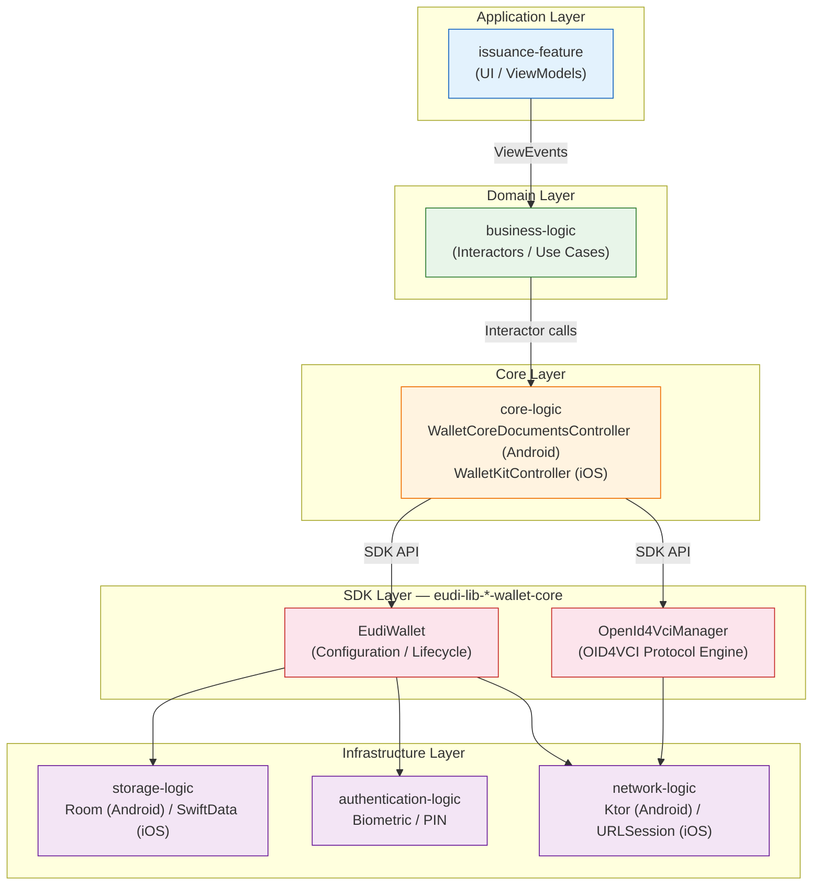

# EUDI Wallet Architecture for Issuance

The European Digital Identity (EUDI) Wallet reference implementation ships as two fully native applications — one for Android (Kotlin) and one for iOS (Swift). Both follow a near-identical module decomposition, but each uses platform-idiomatic patterns and frameworks. This document covers the module hierarchy, key classes, and design patterns that govern the issuance flow on both platforms.

---

## 1. Module Hierarchy

Both platforms decompose the wallet into six logical modules. The dependency direction is strictly top-down: UI modules depend on business logic, which depends on core logic, which depends on the SDK. No upward or circular dependencies exist.

```
issuance-feature  (UI / ViewModels / Screens)
       │
       ▼
business-logic    (Interactors / Use Cases)
       │
       ▼
core-logic        (WalletCoreDocumentsController / WalletKitController)
       │
       ▼
eudi-lib-*-wallet-core SDK
       │
       ├── storage-logic
       ├── authentication-logic
       └── network-logic
```

### Module Responsibilities

| Module | Android | iOS | Role |
|--------|---------|-----|------|
| `issuance-feature` | Jetpack Compose screens, ViewModels | SwiftUI views, ViewModels | Present issuance UI, capture user input, render state |
| `business-logic` | Interactor classes | Interactor classes | Orchestrate multi-step issuance workflows, map domain models |
| `core-logic` | `WalletCoreDocumentsController` | `WalletKitController` | Single entry point into the SDK; translates app-level calls into SDK operations |
| `storage-logic` | Room DB | SwiftData | Persist issued credentials, metadata, issuer records |
| `authentication-logic` | Biometric / PIN via AndroidX | Biometric / PIN via LocalAuthentication | Gate access to key material and wallet operations |
| `network-logic` | Ktor HTTP client | URLSession / custom HTTP | Handle HTTP transport for OID4VCI token and credential endpoints |

---

## 2. Android Architecture

### Technology Stack

| Concern | Technology |
|---------|------------|
| Language | Kotlin |
| UI framework | Jetpack Compose |
| Architecture pattern | MVI (Model-View-Intent) |
| Dependency injection | Koin |
| Local storage | Room |
| HTTP client | Ktor |
| Async model | Kotlin Coroutines + Flow |

### MVI Pattern

The Android app uses a strict MVI cycle with three sealed types per screen:

- **ViewState** — Immutable data class representing the entire screen state. The ViewModel exposes this as a `StateFlow<ViewState>`.
- **ViewEvent** — Sealed class of user-initiated actions (button taps, text input, navigation triggers). The Compose UI dispatches events to the ViewModel.
- **ViewSideEffect** — One-shot effects that cannot be modeled as state (navigation commands, toasts, biometric prompts). Exposed as a `Channel` or `SharedFlow`.

```kotlin
// Simplified from issuance-feature
data class IssuanceViewState(
    val isLoading: Boolean,
    val offerUi: OfferUi?,
    val error: ContentErrorConfig?
)

sealed class IssuanceViewEvent {
    data class Init(val offerUri: String) : IssuanceViewEvent()
    object IssueCredentials : IssuanceViewEvent()
    object Cancel : IssuanceViewEvent()
}

sealed class IssuanceSideEffect {
    data class NavigateToSuccess(val documentIds: List<String>) : IssuanceSideEffect()
    data class ShowError(val message: String) : IssuanceSideEffect()
}
```

The ViewModel processes events, calls into the business-logic interactors, and emits new state plus any side effects:

```kotlin
class IssuanceViewModel(
    private val issuanceInteractor: IssuanceInteractor
) : ViewModel() {

    private val _state = MutableStateFlow(IssuanceViewState())
    val state: StateFlow<IssuanceViewState> = _state.asStateFlow()

    fun handleEvent(event: IssuanceViewEvent) {
        when (event) {
            is IssuanceViewEvent.Init -> resolveOffer(event.offerUri)
            is IssuanceViewEvent.IssueCredentials -> issueDocuments()
            is IssuanceViewEvent.Cancel -> cancel()
        }
    }
}
```

### Dependency Injection with Koin

Each module declares a Koin module that binds its classes. The app-level Koin configuration aggregates all module definitions:

```kotlin
val issuanceFeatureModule = module {
    viewModel { IssuanceViewModel(get()) }
}

val businessLogicModule = module {
    factory { IssuanceInteractor(get()) }
}

val coreLogicModule = module {
    single { WalletCoreDocumentsController(get()) }
}
```

### Key Class: WalletCoreDocumentsController

`WalletCoreDocumentsController` is the issuance orchestrator on Android. It sits in the `core-logic` module and provides the app-facing API for:

- Resolving a credential offer URI into a structured offer object
- Initiating the OID4VCI authorization flow
- Submitting credential requests
- Persisting issued credentials to storage

Internally, it delegates protocol mechanics to `OpenId4VciManager` instances from the `eudi-lib-android-wallet-core` SDK.

### EudiWallet Instantiation

The `EudiWallet` object is configured at application startup with:

- **Configuration** — issuer URLs, supported credential types, redirect URIs
- **Attestation provider** — key attestation mechanism for proof-of-possession
- **Logger** — pluggable logging backend
- **HTTP client** — Ktor-based client, optionally customized with interceptors

```kotlin
val wallet = EudiWallet(context) {
    config = WalletConfig(
        issuerUrl = "https://issuer.example.com",
        // ...
    )
    attestationProvider = AndroidKeystoreAttestationProvider()
    logger = TimberLogger()
    httpClient = KtorHttpClientFactory.create()
}
```

### Multi-Issuer Support

The SDK supports multiple credential issuers simultaneously. Each issuer gets its own `OpenId4VciManager` instance, configured with that issuer's metadata and endpoints. The `WalletCoreDocumentsController` manages the lifecycle of these per-issuer manager instances, creating them on demand when processing an offer from a new issuer and caching them for reuse.

---

## 3. iOS Architecture

### Technology Stack

| Concern | Technology |
|---------|------------|
| Language | Swift |
| UI framework | SwiftUI |
| Architecture pattern | Actor-based concurrency |
| Dependency injection | Swinject |
| Local storage | SwiftData |
| Async model | Swift Concurrency (async/await, actors) |
| Value semantics | Copyable value types for state |

### Actor-Based Concurrency

The iOS app uses Swift actors to serialize access to mutable state, replacing the lock-based or callback-based patterns common in older iOS codebases. The `WalletKitController` is structured as an actor (or uses actor-isolated methods), ensuring that concurrent issuance operations do not produce data races.

```swift
// Simplified from core-logic
actor WalletKitController {
    private let eudiWallet: EudiWallet

    func resolveOffer(_ uri: String) async throws -> CredentialOffer {
        try await eudiWallet.resolveCredentialOffer(uri)
    }

    func issueCredentials(offer: CredentialOffer) async throws -> [IssuedDocument] {
        try await eudiWallet.issueCredentials(offer: offer)
    }
}
```

### Copyable Value Types for State

Screen state is modeled as Swift structs conforming to `Copyable`, enabling cheap value-semantic snapshots that SwiftUI can diff efficiently. This is the iOS analog to Android's immutable `data class` ViewState.

### Swinject Dependency Injection

Swinject provides constructor injection across all modules:

```swift
let container = Container()
container.register(WalletKitController.self) { r in
    WalletKitController(eudiWallet: r.resolve(EudiWallet.self)!)
}
container.register(IssuanceInteractor.self) { r in
    IssuanceInteractor(controller: r.resolve(WalletKitController.self)!)
}
```

### Key Class: WalletKitController

`WalletKitController` is the iOS counterpart to Android's `WalletCoreDocumentsController`. It provides the same logical API surface — offer resolution, authorization, credential request, storage — but implemented with Swift concurrency primitives. It delegates protocol work to `OpenId4VciManager` inside the `eudi-lib-ios-wallet-core` SDK.

---

## 4. OpenId4VciManager and Protocol Encapsulation

On both platforms, `OpenId4VciManager` lives inside the wallet-core SDK and handles all OID4VCI protocol details:

- Fetching and parsing issuer metadata (`.well-known/openid-credential-issuer`)
- Constructing and sending authorization requests
- Exchanging authorization codes for access tokens
- Building credential requests with key proofs
- Parsing credential responses and extracting issued credentials
- Handling deferred issuance (polling for pending credentials)
- Nonce management and replay protection

The application code never constructs OID4VCI HTTP requests directly. It interacts solely with `WalletCoreDocumentsController` / `WalletKitController`, which in turn call `OpenId4VciManager`.

---

## 5. Layer Diagram



---

## 6. Platform Comparison Summary

| Aspect | Android | iOS |
|--------|---------|-----|
| State pattern | MVI (ViewState / ViewEvent / ViewSideEffect) | Actor-isolated state with Copyable value types |
| UI binding | `StateFlow` collected in Compose | `@Published` / `@Observable` in SwiftUI |
| Concurrency | Coroutines + Flow | async/await + Actors |
| DI container | Koin (service locator style) | Swinject (constructor injection) |
| Persistence | Room (SQLite) | SwiftData (Core Data successor) |
| HTTP | Ktor | URLSession / custom HTTP layer |
| Issuance orchestrator | `WalletCoreDocumentsController` | `WalletKitController` |
| SDK | `eudi-lib-android-wallet-core` | `eudi-lib-ios-wallet-core` |

Despite the technology differences, the two platforms maintain near-identical module boundaries and data flow. A developer familiar with one platform can navigate the other by mapping the corresponding framework primitives.
