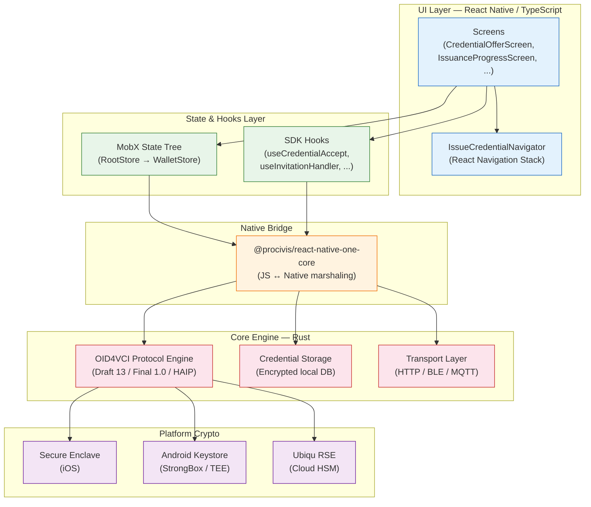

# Procivis ONE Architecture for Issuance

Procivis ONE is a cross-platform wallet built with React Native and TypeScript. It uses a native bridge to delegate cryptographic operations and protocol logic to a Rust-based core engine, while the TypeScript layer handles UI, navigation, and state management. This document covers the layered architecture, state management, navigation model, SDK hooks, and configuration system that govern the issuance flow.

---

## 1. Layered Architecture

```
Screens (UI) — React Native components
       │
       ▼
Hooks / Navigation — Custom hooks, React Navigation
       │
       ▼
@procivis/react-native-one-core SDK (Native Bridge)
       │
       ▼
Platform Crypto — Secure Enclave (iOS) / Android Keystore / Ubiqu RSE
```

### Layer Responsibilities

| Layer | Technology | Role |
|-------|-----------|------|
| Screens | React Native (TypeScript) | Render issuance UI, capture user input, display credential previews |
| Hooks / Navigation | Custom React hooks, React Navigation | Manage async SDK calls, route between issuance screens, handle deep links |
| Native Bridge SDK | `@procivis/react-native-one-core` | Expose core engine functions to JavaScript; marshal data across the bridge |
| Core Engine | Rust (compiled per platform) | OID4VCI protocol logic, credential parsing, proof construction, storage encryption |
| Platform Crypto | Secure Enclave / Android Keystore / Ubiqu RSE | Hardware-backed key generation, signing, attestation |

---

## 2. State Management with MobX State Tree

Procivis uses MobX State Tree (MST) for application state. The root store composes domain-specific sub-stores, including `WalletStore` for credential and issuance state.

### Store Hierarchy

```
RootStore
  ├── WalletStore        — credentials, issuance state, offer data
  ├── NavigationStore    — current route, navigation history
  ├── SettingsStore      — user preferences, biometric config
  └── ConnectionStore    — active transport connections
```

### WalletStore

`WalletStore` manages the credential lifecycle:

```typescript
// Simplified from the store definitions
const WalletStore = types
  .model("WalletStore", {
    credentials: types.array(CredentialModel),
    pendingOffer: types.maybe(CredentialOfferModel),
    issuanceInProgress: types.optional(types.boolean, false),
  })
  .actions((self) => ({
    acceptCredential: flow(function* (interactionId: string) {
      self.issuanceInProgress = true;
      try {
        yield oneCore.credentialAccept(interactionId);
      } finally {
        self.issuanceInProgress = false;
      }
    }),
    rejectCredential: flow(function* (interactionId: string) {
      yield oneCore.credentialReject(interactionId);
      self.pendingOffer = undefined;
    }),
  }));
```

MST provides several properties that suit the wallet use case:

- **Immutable snapshots** — Every state change produces a serializable snapshot, useful for debugging and persistence.
- **Type safety** — MST models enforce runtime types, catching malformed credential data early.
- **Action tracking** — All mutations go through defined actions, producing an auditable log of state changes.

---

## 3. Navigation with React Navigation

The issuance flow is managed by a dedicated `IssueCredentialNavigator` that defines the screen stack for the entire issuance journey.

### IssueCredentialNavigator Screen Stack

```typescript
// Simplified from the navigator definition
const IssueCredentialStack = createNativeStackNavigator();

function IssueCredentialNavigator() {
  return (
    <IssueCredentialStack.Navigator>
      <IssueCredentialStack.Screen
        name="CredentialOffer"
        component={CredentialOfferScreen}
      />
      <IssueCredentialStack.Screen
        name="CredentialAccept"
        component={CredentialAcceptScreen}
      />
      <IssueCredentialStack.Screen
        name="IssuanceProgress"
        component={IssuanceProgressScreen}
      />
      <IssueCredentialStack.Screen
        name="IssuanceResult"
        component={IssuanceResultScreen}
      />
    </IssueCredentialStack.Navigator>
  );
}
```

Navigation between screens is driven by issuance state transitions. When the user accepts an offer, the navigator pushes to `IssuanceProgress`; when the core engine reports completion, it navigates to `IssuanceResult`.

---

## 4. Core SDK Hooks

The `@procivis/react-native-one-core` package exposes React hooks that wrap native bridge calls. These hooks encapsulate the async lifecycle of each issuance operation:

| Hook | Purpose |
|------|---------|
| `useInvitationHandler` | Parse and process an incoming credential offer URI (deep link or QR scan) |
| `useCredentialAccept` | Accept a pending credential offer, triggering the OID4VCI exchange |
| `useCredentialReject` | Reject a pending credential offer, cleaning up local state |
| `useContinueIssuance` | Resume a deferred or multi-step issuance flow |
| `useInitiateIssuance` | Programmatically start issuance for a known issuer and credential type |

### Hook Usage Pattern

```typescript
function CredentialOfferScreen({ route }) {
  const { offerId } = route.params;
  const { accept, isLoading, error } = useCredentialAccept();
  const { reject } = useCredentialReject();

  const handleAccept = async () => {
    try {
      await accept(offerId);
      navigation.navigate("IssuanceProgress");
    } catch (e) {
      // error state is also available via the hook
    }
  };

  const handleReject = async () => {
    await reject(offerId);
    navigation.goBack();
  };

  // ... render offer details, accept/reject buttons
}
```

The hooks manage loading states, error states, and result data internally, exposing them as reactive values that trigger re-renders when they change.

---

## 5. Transport Abstraction Layer

Procivis ONE supports multiple transport protocols for credential exchange, abstracted behind a unified interface in the core engine:

| Transport | Use Case |
|-----------|----------|
| **HTTP** | Standard OID4VCI issuance over HTTPS |
| **BLE** | Proximity-based credential exchange (offline capable) |
| **MQTT** | Pub/sub messaging for asynchronous issuance flows |

The transport layer is configured at the core engine level. The React Native layer does not interact with transport details directly — it calls the same SDK hooks regardless of which transport the core engine selects for a given exchange.

---

## 6. Build Flavors

The project defines multiple build flavors that configure the wallet for different environments and deployment targets:

| Flavor | Purpose |
|--------|---------|
| `dev` | Local development; points to development issuer instances |
| `test` | QA and automated testing; uses test credential schemas |
| `trial` | External trial deployments; limited credential types |
| `demo` | Demonstration builds; pre-configured issuers and sample credentials |

Each flavor overrides:
- Issuer endpoint URLs
- Supported credential types and schemas
- Feature flags (e.g., BLE transport enabled/disabled)
- Branding and display configuration

---

## 7. Core Configuration

The core engine is configured with a declarative configuration that specifies supported protocols, key storage backends, and credential formats.

### Supported Issuance Protocols

```typescript
// From core configuration
const issuanceProtocols = [
  "OPENID4VCI_DRAFT13",
  "OPENID4VCI_DRAFT13_SWIYU",
  "OPENID4VCI_FINAL1",
  "OPENID4VCI_FINAL1_HAIP",
];
```

| Protocol | Description |
|----------|-------------|
| `OPENID4VCI_DRAFT13` | OID4VCI Draft 13 baseline |
| `OPENID4VCI_DRAFT13_SWIYU` | Draft 13 with Swiss swiyu profile extensions |
| `OPENID4VCI_FINAL1` | OID4VCI Final 1.0 specification |
| `OPENID4VCI_FINAL1_HAIP` | Final 1.0 with High Assurance Interoperability Profile |

This multi-protocol support allows Procivis to interact with issuers at different stages of specification adoption without requiring app updates.

### Key Storage Configuration

```typescript
// Key storage backends
const keyStorageOptions = [
  "INTERNAL",        // Software-encrypted storage within the app
  "SECURE_ELEMENT",  // Hardware-backed: Secure Enclave (iOS) / Android Keystore
  "UBIQU_RSE",       // Ubiqu Remote Secure Element (cloud HSM)
];
```

| Backend | Description |
|---------|-------------|
| `INTERNAL` | Encrypted key storage in the app sandbox. Software-only; no hardware root of trust. |
| `SECURE_ELEMENT` | Hardware-backed key storage. Maps to Secure Enclave on iOS and StrongBox/TEE Keystore on Android. |
| `UBIQU_RSE` | Remote Secure Element provided by Ubiqu. Keys are generated and stored in a cloud HSM; signing operations are remote calls. Enables key portability across devices. |

The key storage backend is selected per key, allowing a single wallet to hold credentials with different security levels.

---

## 8. Layer Diagram



---

## 9. Summary

Procivis ONE's architecture achieves cross-platform reach through React Native while keeping security-critical logic in a compiled Rust core engine. The native bridge acts as a clean seam: the TypeScript layer owns UI, navigation, and state; the Rust layer owns protocol execution, cryptography, and storage encryption. This split means that protocol upgrades (e.g., moving from Draft 13 to Final 1.0) can ship as core engine updates without touching the React Native layer, and UI redesigns can proceed without modifying protocol logic.
