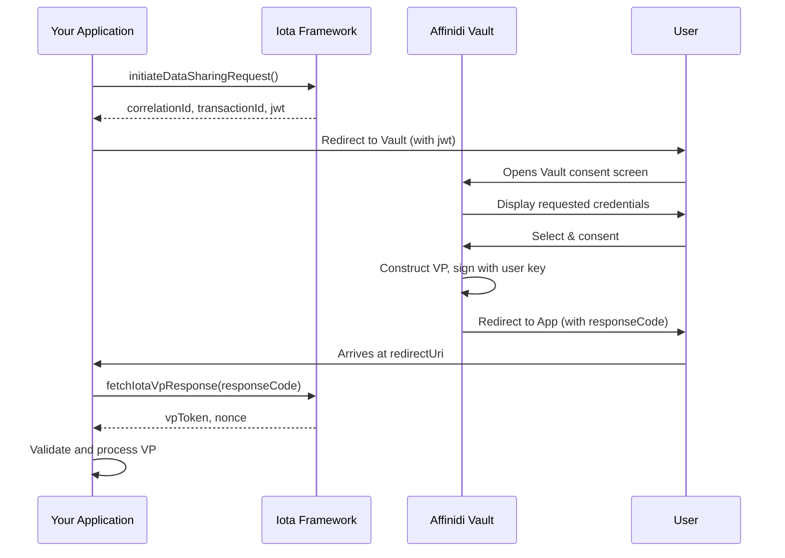

# Affinidi Architecture for Verification

Affinidi implements verification through the Iota Framework, a cloud-based solution that enables applications to request and receive verifiable credentials from users' Affinidi Vaults. Unlike the device-centric EUDI and Procivis implementations, Affinidi's architecture is built around cloud services with web SDK integration.

---

## 1. Architecture Overview

```
┌─────────────────────────────────────────────────────────────────┐
│  Application Layer                                               │
│  ┌──────────────────────────────────────────────────────────┐  │
│  │  Your Application (NextJS, React, etc.)                   │  │
│  │  - Integrates Affinidi TDK packages                       │  │
│  │  - Initiates data sharing requests                        │  │
│  │  - Receives VP tokens                                     │  │
│  └────────────────────────┬─────────────────────────────────┘  │
├───────────────────────────┼─────────────────────────────────────┤
│  Affinidi TDK             │                                      │
│  ┌────────────────────────▼─────────────────────────────────┐  │
│  │  @affinidi-tdk/iota-browser                               │  │
│  │  @affinidi-tdk/iota-core                                  │  │
│  │  @affinidi-tdk/iota-client                                │  │
│  └────────────────────────┬─────────────────────────────────┘  │
├───────────────────────────┼─────────────────────────────────────┤
│  Affinidi Cloud Services  │                                      │
│  ┌────────────────────────▼─────────────────────────────────┐  │
│  │  Iota Framework Service                                   │  │
│  │  ┌───────────────┐  ┌───────────────┐  ┌──────────────┐  │  │
│  │  │ Configuration │  │ Request       │  │ Response     │  │  │
│  │  │ Management    │  │ Initiation    │  │ Retrieval    │  │  │
│  │  └───────────────┘  └───────────────┘  └──────────────┘  │  │
│  └────────────────────────┬─────────────────────────────────┘  │
├───────────────────────────┼─────────────────────────────────────┤
│  Affinidi Vault           │                                      │
│  ┌────────────────────────▼─────────────────────────────────┐  │
│  │  User's Credential Storage                                │  │
│  │  - Stores Verifiable Credentials                          │  │
│  │  - Manages consent flow                                   │  │
│  │  - Constructs Verifiable Presentations                    │  │
│  │  - Signs with user's keys                                 │  │
│  └──────────────────────────────────────────────────────────┘  │
└─────────────────────────────────────────────────────────────────┘
```

---

## 2. Core Components

### Iota Framework

The Iota Framework is Affinidi's OID4VP implementation that enables consent-based data sharing:

- **Protocol**: OID4VP (OpenID for Verifiable Presentations)
- **Query Language**: DIF Presentation Exchange (PEX)
- **Transport**: HTTPS (WebSocket or Redirect modes)

### Affinidi TDK Packages

```bash
npm install @affinidi-tdk/iota-browser @affinidi-tdk/iota-core @affinidi-tdk/iota-client
```

| Package | Purpose |
|---------|---------|
| `@affinidi-tdk/iota-browser` | Browser-side SDK for initiating requests |
| `@affinidi-tdk/iota-core` | Core types and utilities |
| `@affinidi-tdk/iota-client` | Server-side API client |

### Affinidi Vault

The user's credential wallet:
- Stores credentials issued via Affinidi or other OID4VCI issuers
- Displays consent screens for data sharing
- Constructs and signs Verifiable Presentations
- Cloud-based with user authentication

---

## 3. Integration Modes

### WebSocket Mode

Real-time communication for seamless UX:

```typescript
const {
  isInitializing,
  handleInitiate,
  errorMessage,
  dataRequest,
  data: iotaRequestData,
} = useIotaQuery({ configurationId: iotaConfigId });

// Initiate data request
const handleShareTicket = () => {
  handleInitiate(eventTicketQuery);
};

// Handle response
useEffect(() => {
  if (!iotaRequestData) return;
  const eventTicketData = iotaRequestData[eventTicketQuery];
  if (eventTicketData) {
    setEventTicketData(eventTicketData);
  }
}, [iotaRequestData]);
```

### Redirect Mode

Simplified integration without Affinidi Login prerequisite:

1. Application initiates request
2. User redirected to Affinidi Vault
3. User consents and responds
4. User redirected back with response code
5. Application fetches VP token

---

## 4. API Structure

### API 1: Initiate Data Sharing Request

**Endpoint:** `/api/iota/start-redirect-flow`

```typescript
import { IotaApi, Configuration } from '@affinidi-tdk/iota-client';

const api = new IotaApi(
  new Configuration({
    apiKey: authProvider.fetchProjectScopedToken.bind(authProvider),
  })
);

const { data: dataSharingRequestResponse } =
  await api.initiateDataSharingRequest({
    configurationId,
    mode: IotaConfigurationDtoModeEnum.Redirect,
    queryId,
    correlationId: uuidv4(),
    nonce,
    redirectUri,
  });

const { correlationId, transactionId, jwt } =
  dataSharingRequestResponse.data as InitiateDataSharingRequestOKData;
```

**Parameters:**

| Parameter | Description |
|-----------|-------------|
| `configurationId` | Iota configuration ID from Affinidi Portal |
| `mode` | `Redirect` or `WebSocket` |
| `queryId` | Presentation definition query ID |
| `correlationId` | Application-generated identifier |
| `nonce` | Cryptographic nonce for request binding |
| `redirectUri` | Where to send user after consent |

**Response:**

| Field | Description |
|-------|-------------|
| `correlationId` | Echoed back for correlation |
| `transactionId` | Affinidi-generated transaction identifier |
| `jwt` | Access token for Vault validation |

### API 2: Fetch VP Response

**Endpoint:** `/api/iota/iota-response`

```typescript
const iotaVpResponse: FetchIOTAVPResponseOK = await api.fetchIotaVpResponse({
  configurationId,
  correlationId,
  transactionId,
  responseCode,
});

const vp = JSON.parse((iotaVpResponse.data as any).vpToken);
```

**Parameters:**

| Parameter | Description |
|-----------|-------------|
| `configurationId` | Same as initiation |
| `correlationId` | Application's correlation ID |
| `transactionId` | From initiation response |
| `responseCode` | From redirect callback |

**Response:**

| Field | Description |
|-------|-------------|
| `vpToken` | Verifiable Presentation JSON |
| `nonce` | For validation against request |

---

## 5. PEX Query Structure

Affinidi uses DIF Presentation Exchange for credential queries:

```json
{
  "id": "event_ticket",
  "input_descriptors": [
    {
      "id": "event_ticket",
      "name": "EventTicket VC",
      "purpose": "Check VC",
      "constraints": {
        "fields": [
          {
            "path": ["$.type"],
            "purpose": "VC Type Check",
            "filter": {
              "type": "array",
              "contains": {
                "type": "string",
                "pattern": "^EventTicketVC$"
              }
            }
          }
        ]
      }
    }
  ]
}
```

### PEX Components

| Component | Purpose |
|-----------|---------|
| `id` | Query identifier |
| `input_descriptors` | Array of credential requirements |
| `input_descriptors[].constraints` | Field-level requirements |
| `constraints.fields` | JSONPath-based field specifications |
| `constraints.fields[].filter` | JSON Schema filter for values |

---

## 6. Configuration via Affinidi Portal

### Iota Configuration Setup

1. **Configuration Name**: Identifier for the configuration
2. **Display Name**: Shown to users in consent screen
3. **Data Sharing Flow Mode**: Redirect or WebSocket
4. **Redirect URL**: Callback URL after consent
5. **Credential Verification**: Enable/disable VP validation
6. **Consent Audit Log**: Track data-sharing consent

### Environment Variables

```env
NEXT_PUBLIC_IOTA_CONFIG_ID=""
NEXT_PUBLIC_IOTA_EVENT_TICKET_QUERY=""
```

---

## 7. Verification Flow



---

## 8. Credential Verification Service

Affinidi provides automatic credential verification when enabled:

**Capabilities:**
- **Format Validation**: Validates VC/VP structure against standards
- **Authenticity Verification**: Cryptographically verifies signatures
- **Tamper Detection**: Ensures credentials haven't been modified

When enabled in configuration, the VP token is automatically verified before being returned to the application.

---

## 9. React Hook Integration

**Location:** Custom hooks in application code

```typescript
// useIotaQuery hook
const useIotaQuery = ({ configurationId }: { configurationId: string }) => {
  const [isInitializing, setIsInitializing] = useState(false);
  const [errorMessage, setErrorMessage] = useState<string | null>(null);
  const [data, setData] = useState<Record<string, any> | null>(null);

  const handleInitiate = async (queryId: string) => {
    setIsInitializing(true);
    try {
      // 1. Call backend to initiate request
      const response = await fetch('/api/iota/start-redirect-flow', {
        method: 'POST',
        body: JSON.stringify({ configurationId, queryId }),
      });

      // 2. Handle redirect or WebSocket response
      // ...
    } catch (error) {
      setErrorMessage(error.message);
    } finally {
      setIsInitializing(false);
    }
  };

  return { isInitializing, handleInitiate, errorMessage, data };
};
```

---

## 10. Key Differences from Native Implementations

| Aspect | EUDI/Procivis | Affinidi |
|--------|---------------|----------|
| **Wallet location** | Device (mobile app) | Cloud (Affinidi Vault) |
| **Key storage** | Device secure element | Cloud HSM |
| **Integration** | Mobile SDK | Web SDK (TDK) |
| **Transport** | Deep links, BLE, NFC | HTTPS (redirect/WebSocket) |
| **Signing** | Local (device) | Remote (Vault) |
| **Offline support** | Yes (proximity) | No (cloud-dependent) |

---

## 11. Security Considerations

### Trust Model

- User authenticates to Affinidi Vault
- Vault manages credential storage and signing
- Applications receive signed VPs without direct key access
- TLS for all communications

### Consent

- Explicit user consent required for each data sharing
- Consent audit logging available
- User sees exactly what data is requested and why

### Nonce Binding

- Request includes cryptographic nonce
- Nonce returned with VP for validation
- Prevents replay attacks

---

## 12. Limitations

**Source Code Availability:**
- Affinidi Vault and Iota Framework are closed-source cloud services
- Analysis based on public documentation and SDK interfaces
- Internal implementation details not available

**Deployment Model:**
- Cloud-dependent (no self-hosted option documented)
- Requires Affinidi account and configuration
- Different compliance considerations than self-sovereign device wallets

---

## 13. Key Resources

| Resource | URL |
|----------|-----|
| Affinidi Documentation | https://docs.affinidi.com |
| Iota Framework Docs | https://docs.affinidi.com/frameworks/iota-framework/ |
| TDK Reference | https://docs.affinidi.com/dev-tools/affinidi-tdk/ |
| PEX Editor | https://docs.affinidi.com/dev-tools/affinidi-portal/portal-pex-editor/ |
| Sample Applications | GitHub: affinidi/eventi-workshop |
