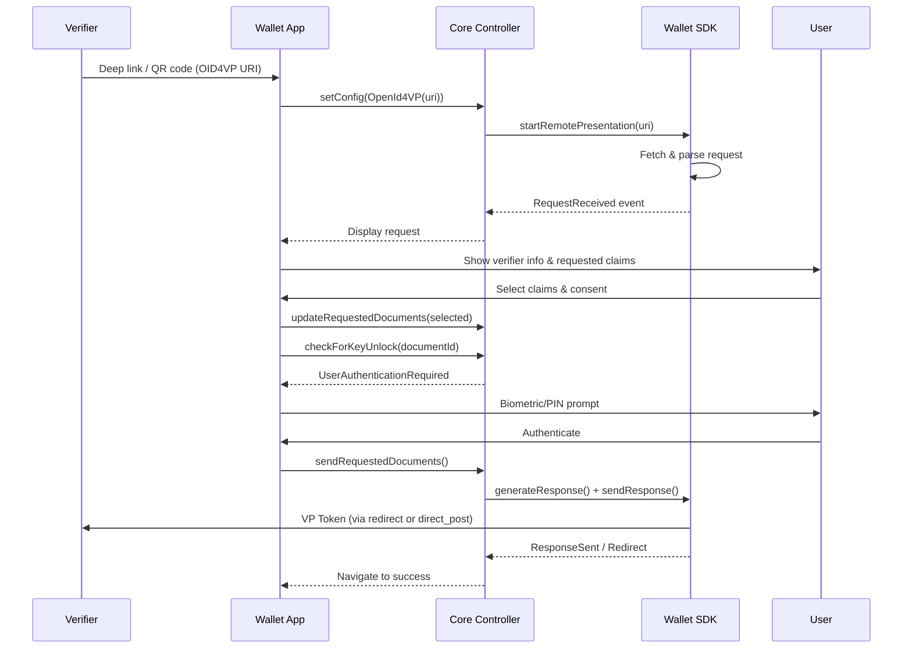

# EUDI Wallet Architecture for Verification

The EUDI Wallet implements verification through a well-structured module hierarchy that mirrors the issuance architecture. Both Android (Kotlin) and iOS (Swift) platforms follow near-identical patterns, enabling developers familiar with one to navigate the other easily.

---

## 1. Module Hierarchy

The verification flow spans these modules, with dependencies flowing strictly downward:

```
presentation-feature / proximity-feature  (UI / ViewModels / Screens)
       │
       ▼
business-logic / interactors              (Use Cases / Orchestration)
       │
       ▼
core-logic                                (WalletCorePresentationController / Coordinators)
       │
       ▼
eudi-lib-*-wallet-core SDK               (OID4VP Protocol Engine)
       │
       ├── storage-logic
       ├── authentication-logic
       └── network-logic
```

### Module Responsibilities

| Module | Android | iOS | Role |
|--------|---------|-----|------|
| `presentation-feature` | Jetpack Compose screens | SwiftUI views | Remote verification UI |
| `proximity-feature` | Jetpack Compose screens | SwiftUI views | BLE/NFC proximity UI |
| `common-feature` | Shared transformers | Shared models | Credential transformation, UI models |
| `core-logic` | `WalletCorePresentationController` | `RemoteSessionCoordinator`, `ProximitySessionCoordinator` | Protocol orchestration |
| `authentication-logic` | Biometric/PIN | LAContext | Gate access to signing keys |

---

## 2. Android Architecture

### Key Classes

#### WalletCorePresentationController

**Location:** `core-logic/src/main/java/eu/europa/ec/corelogic/controller/WalletCorePresentationController.kt`

The central orchestrator for all presentation operations. It provides:

```kotlin
interface WalletCorePresentationController {
    // State observation
    fun observeSentDocumentsRequest(): Flow<WalletCorePartialState>

    // Configuration
    fun setConfig(config: PresentationControllerConfig)

    // Operations
    suspend fun startQrEngagement()
    fun toggleNfcEngagement(toggle: Boolean)
    suspend fun checkForKeyUnlock(documentId: String): CheckKeyUnlockPartialState
    suspend fun updateRequestedDocuments(disclosedDocuments: List<DisclosedDocument>)
    suspend fun sendRequestedDocuments(): SendRequestedDocumentsPartialState
    fun stopPresentation()
}
```

**Configuration variants:**

```kotlin
sealed class PresentationControllerConfig {
    data class OpenId4VP(val uri: String) : PresentationControllerConfig()
    object Ble : PresentationControllerConfig()
}
```

#### PresentationRequestInteractor

**Location:** `presentation-feature/src/main/java/eu/europa/ec/presentationfeature/interactor/PresentationRequestInteractor.kt`

Handles business logic for the presentation request screen:

```kotlin
interface PresentationRequestInteractor {
    fun setConfig(config: RequestUriConfig)
    fun getRequestDocuments(): Flow<PresentationRequestInteractorPartialState>
    fun updateRequestedDocuments(items: List<RequestDocumentItemUi>)
}
```

Key responsibilities:
- Receives presentation request from core controller
- Filters available documents by revocation status
- Transforms documents to UI representation
- Updates selected documents in core controller

#### RequestTransformer

**Location:** `common-feature/src/main/java/eu/europa/ec/commonfeature/ui/request/transformer/RequestTransformer.kt`

Transforms between domain models and UI models:

```kotlin
object RequestTransformer {
    // Match stored credentials to verifier request
    fun transformToDomainItems(
        storageDocuments: List<DocumentPayload>,
        requestedDocuments: List<RequestedDocument>,
        requiredFields: RequiredFields
    ): List<RequestDataUi>

    // Build response with selected claims
    fun createDisclosedDocuments(
        items: List<RequestDataUi>,
        requiredFields: RequiredFields
    ): List<DisclosedDocument>
}
```

### State Machine

```kotlin
sealed class TransferEventPartialState {
    data object Connected : TransferEventPartialState()
    data object Connecting : TransferEventPartialState()
    data object Disconnected : TransferEventPartialState()
    data class Error(val error: String) : TransferEventPartialState()
    data class QrEngagementReady(val qrCode: String) : TransferEventPartialState()
    data class RequestReceived(
        val processedRequest: ProcessedRequest,
        val requestedDocuments: List<RequestedDocument>,
        val verifierName: String?,
        val verifierIsTrusted: Boolean
    ) : TransferEventPartialState()
    data class ResponseSent(val responseBytes: ByteArray) : TransferEventPartialState()
    data class Redirect(val uri: URI) : TransferEventPartialState()
}
```

### Navigation Flow

**Location:** `presentation-feature/src/main/java/eu/europa/ec/presentationfeature/router/Graph.kt`

```
PRESENTATION_REQUEST
    │
    ▼ (user taps Share)
PRESENTATION_LOADING
    │
    ▼ (response sent)
PRESENTATION_SUCCESS
```

---

## 3. iOS Architecture

### Key Classes

#### RemoteSessionCoordinator

**Location:** `Modules/logic-core/Sources/Coordinator/RemoteSessionCoordinator.swift`

Wraps the EudiWalletKit presentation session for OID4VP flows:

```swift
public protocol RemoteSessionCoordinator: Sendable {
    func initialize() async
    func requestReceived() async throws -> PresentationRequest
    func sendResponse(response: RequestItemConvertible) async
    func getStream() -> AsyncStream<PresentationState>
    func setState(presentationState: PresentationState) async throws
    func getState() async throws -> PresentationState?
    func clear() async
}
```

#### ProximitySessionCoordinator

**Location:** `Modules/logic-core/Sources/Coordinator/ProximitySessionCoordinator.swift`

Handles BLE proximity presentation:

```swift
public protocol ProximitySessionCoordinator: Sendable {
    func initialize() async throws
    func startQrEngagement() async throws -> UIImage  // QR for device engagement
    func requestReceived() async throws -> PresentationRequest
    func sendResponse(response: RequestItemConvertible) async
    func getStream() -> AsyncStream<PresentationState>
}
```

#### PresentationState

**Location:** `Modules/logic-core/Sources/Coordinator/Model/PresentationState.swift`

```swift
public enum PresentationState: Sendable {
    case loading
    case prepareQr
    case qrReady(imageData: Data)
    case requestReceived(PresentationRequest)
    case responseToSend(RequestItemConvertible)
    case responseSent(URL?)
    case error(Error)
}
```

#### WalletKitController

**Location:** `Modules/logic-core/Sources/Controller/WalletKitController.swift`

Entry point for initiating presentations:

```swift
actor WalletKitController {
    // Remote (OID4VP) presentation
    func startRemotePresentation(urlString: String) async -> RemoteSessionCoordinator

    // Same-device presentation (deep link)
    func startSameDevicePresentation(deepLink: URLComponents) async -> RemoteSessionCoordinator

    // Proximity (BLE) presentation
    func startProximityPresentation() async -> ProximitySessionCoordinator

    // Cleanup
    func stopPresentation() async
}
```

### Actor-Based Concurrency

iOS uses Swift actors for thread safety:

```swift
actor SessionCoordinatorHolder {
    private var activeRemoteCoordinator: RemoteSessionCoordinator?
    private var activeProximityCoordinator: ProximitySessionCoordinator?

    func setActiveRemoteCoordinator(_ coordinator: RemoteSessionCoordinator)
    func getActiveRemoteCoordinator() throws -> RemoteSessionCoordinator
    func setActiveProximityCoordinator(_ coordinator: ProximitySessionCoordinator)
    func getActiveProximityCoordinator() throws -> ProximitySessionCoordinator
}
```

---

## 4. Entry Points

### Deep Link Handling

**Android:** `DeepLinkHelper.kt`
```kotlin
enum class DeepLinkType {
    OPENID4VP(
        schemas = listOf(
            "openid4vp",
            "eudi-openid4vp",
            "mdoc-openid4vp",
            "haip-openid4vp"
        )
    )
}
```

**iOS:** `Application.swift` + `DeepLinkController.swift`
```swift
.onOpenURL { url in
    // Parse OID4VP deep link
    // Route to PresentationRequestView
}
```

### QR Code Scanning

Both platforms detect OID4VP URIs when scanning QR codes and route to the presentation flow.

---

## 5. Presentation Flow Diagram



---

## 6. OID4VP Configuration

**Android:** `WalletCoreConfigImpl.kt`

```kotlin
configureOpenId4Vp {
    withClientIdSchemes(
        listOf(
            ClientIdScheme.X509SanDns,
            ClientIdScheme.X509Hash
        )
    )
    withSchemes(
        listOf("openid4vp", "eudi-openid4vp", "mdoc-openid4vp", "haip-openid4vp")
    )
    withFormats(
        Format.MsoMdoc.ES256,
        Format.SdJwtVc.ES256
    )
}
```

**iOS:** `WalletKitConfig.swift`

```swift
struct WalletKitConfigImpl: WalletKitConfig {
    var vpConfig: OpenId4VpConfiguration {
        // Configured with trusted reader certificates
    }

    var readerConfig: ReaderConfig {
        ReaderConfig(trustedCerts: trustedCertificates)
    }
}
```

---

## 7. Key Files Reference

### Android

| File | Purpose |
|------|---------|
| `WalletCorePresentationController.kt` | Central presentation orchestrator |
| `PresentationRequestInteractor.kt` | Request handling & document filtering |
| `PresentationLoadingInteractor.kt` | Authentication & response sending |
| `RequestTransformer.kt` | Document/claim transformation |
| `DeepLinkHelper.kt` | Entry point handling |
| `EudiWalletListenerWrapper.kt` | SDK event handling |
| `ProximityRequestInteractor.kt` | BLE presentation handling |

### iOS

| File | Purpose |
|------|---------|
| `WalletKitController.swift` | WalletKit bridge, presentation initiation |
| `RemoteSessionCoordinator.swift` | OID4VP session management |
| `ProximitySessionCoordinator.swift` | BLE session management |
| `PresentationInteractor.swift` | Business logic orchestration |
| `RequestDataUIModel.swift` | Credential model & transformation |
| `DeepLinkController.swift` | Deep link routing |
| `SessionCoordinatorHolder.swift` | Active session management |

---

## 8. Credential Format Handling

Both platforms support multiple credential formats through the SDK:

| Format | Namespace/Path Style | Response Structure |
|--------|---------------------|-------------------|
| MSO-MDOC | `namespace:elementIdentifier` | CBOR DeviceResponse |
| SD-JWT-VC | JSON path array | JWT with selective disclosure |

The `RequestTransformer` / `RequestDataUIModel` abstracts these differences at the UI layer.
